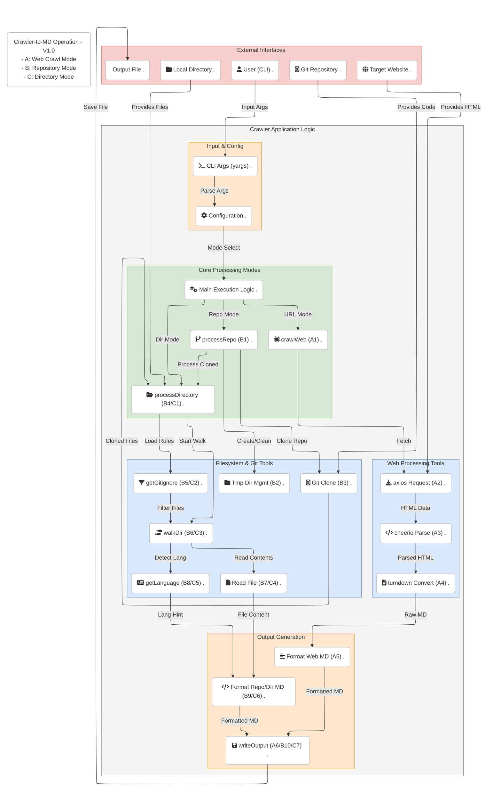
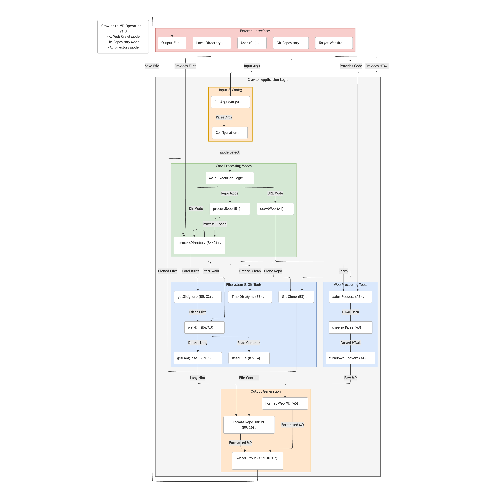

# crawler-to-md

`crawler-to-md` is a versatile Node.js command-line tool designed to fetch content from various sources (websites, Git repositories, local directories) and consolidate it into a single, structured Markdown file. This is particularly useful for feeding context to Large Language Models (LLMs), archiving project snapshots, or generating documentation outlines.

## Diagram





## Features

*   **Multiple Operating Modes:**
    *   Crawl websites based on URL.
    *   Clone and process Git repositories (HTTPS or SSH).
    *   Process local directories.
*   **Web Crawling:**
    *   Configurable crawl depth.
    *   Focuses on main content extraction (attempts `main`, `article`, `body` tags).
    *   Removes common non-content elements (scripts, styles, headers, footers, navs, etc.).
    *   Converts HTML to Markdown using [Turndown](https://github.com/mixmark-io/turndown).
    *   Stays within the same domain as the starting URL.
*   **Repository & Directory Processing:**
    *   Generates a directory tree structure in the Markdown output.
    *   Includes file content formatted within code blocks.
    *   Automatic language detection for syntax highlighting hints in Markdown.
    *   Respects `.gitignore` rules by default.
    *   Optionally includes dotfiles/directories (except `.git` unless explicitly overridden by `.gitignore`).
    *   Skips content of common binary/non-text file extensions (images, videos, archives, executables, etc. - see `OMIT_CONTENT_EXTENSIONS` in code).
    *   Truncates extremely large files to prevent excessive output size.
*   **Customization:**
    *   Specify output file name.
    *   For Git repos, specify a branch to clone.
*   **Robustness:**
    *   Handles temporary directory creation and cleanup for Git clones.
    *   Basic error handling for network requests and file system operations.

## Installation

This tool is intended to be used as a global command-line utility. Install it using npm:

```bash
npm install -g crawler-to-md
```

Ensure that your Node.js environment's global `bin` directory is included in your system's `PATH`.

## Usage

The tool is run from your terminal. You **must** specify exactly one operating mode (`--url`, `--repo`, or `--dir`).

```bash
crawler-to-md [mode_option] [other_options]
```

### Help

To see the built-in help menu with all available options:

```bash
crawler-to-md --help
```

or

```bash
crawler-to-md -h
```

## Modes of Operation

You must choose one of the following modes by providing the corresponding option:

1.  **URL Mode (`--url` or `-u`):** Crawls a website starting from the given URL.
2.  **Repository Mode (`--repo` or `-r`):** Clones a Git repository and processes its contents.
3.  **Directory Mode (`--dir` or `-d`):** Processes the contents of a specified local directory.

Using more than one of these mode options simultaneously will result in an error.

## Parameters / Options

Here is a detailed list of all available command-line parameters:

| Option                | Alias | Type      | Description                                                                                                 | Default     | Applicable Modes | Required                  |
| :-------------------- | :---- | :-------- | :---------------------------------------------------------------------------------------------------------- | :---------- | :--------------- | :------------------------ |
| `--url`               | `-u`  | `string`  | The starting URL of the website to crawl.                                                                   | `undefined` | URL              | Yes, if using URL mode    |
| `--repo`              | `-r`  | `string`  | The URL of the Git repository (HTTPS or SSH) to clone and process.                                          | `undefined` | Repo             | Yes, if using Repo mode   |
| `--dir`               | `-d`  | `string`  | The path to the local directory to process.                                                                 | `undefined` | Dir              | Yes, if using Dir mode    |
| `--output`            | `-o`  | `string`  | The name of the output Markdown file.                                                                       | `output.md` | All              | No                        |
| `--depth`             | `-l`  | `number`  | Maximum depth for web crawling. `0` processes only the start URL, `1` processes the start URL and its direct links, etc. | `1`         | URL              | No                        |
| `--branch`            | `-b`  | `string`  | Specify a particular branch to clone from the Git repository. If not provided, the repository's default branch is used. | `undefined` | Repo             | No                        |
| `--include-dot-files` |       | `boolean` | Include files and directories that start with a dot (`.`). Note: `.git` is always excluded unless overridden by `.gitignore`. | `false`     | Repo, Dir        | No                        |
| `--help`              | `-h`  | `boolean` | Show the help message and exit.                                                                             | `false`     | All              | No                        |
| `--version`           | `-v`  | `boolean` | Show the package version number and exit.                                                                   | `false`     | All              | No                        |

---

## Examples

### 1. URL Mode Examples

*   **Crawl a single page (depth 0) and save to `page.md`:**

    ```bash
    crawler-to-md --url "https://example.com/some/page.html" --depth 0 --output page.md
    ```

*   **Crawl a website up to depth 2 (start page + links + links from those links) using default output `output.md`:**

    ```bash
    crawler-to-md -u "https://developer.mozilla.org/en-US/docs/Web/JavaScript" -l 2
    ```

*   **Crawl a site with default depth (1) and save to `website_content.md`:**

    ```bash
    crawler-to-md --url "https://nodejs.org/en/about" --output website_content.md
    ```

### 2. Repository Mode Examples

*   **Clone the default branch of a public repository and save to `repo_docs.md`:**

    ```bash
    crawler-to-md --repo "https://github.com/nodejs/node.git" --output repo_docs.md
    ```

*   **Clone a specific branch (`v18.x`) of a repository using the alias `-r`:**

    ```bash
    crawler-to-md -r "https://github.com/nodejs/node.git" -b v18.x
    ```
    *(Output will be `output.md` by default)*

*   **Clone a private repository using SSH (ensure your SSH keys are configured):**

    ```bash
    crawler-to-md --repo "git@github.com:your-username/your-private-repo.git"
    ```

*   **Clone a repository and include dotfiles (like `.env.example`, `.prettierrc`):**

    ```bash
    crawler-to-md -r "https://github.com/some/project.git" --include-dot-files --output project_with_dotfiles.md
    ```

### 3. Directory Mode Examples

*   **Process the current directory (`.`):**

    ```bash
    crawler-to-md --dir .
    ```
    *(Output will be `output.md`)*

*   **Process a specific local directory `/path/to/my/project` and save to `my_project.md`:**

    ```bash
    crawler-to-md -d "/path/to/my/project" -o my_project.md
    ```

*   **Process a directory relative to the current location and include dotfiles:**

    ```bash
    crawler-to-md --dir "../another-project" --include-dot-files --output another_project_structure.md
    ```

## Output Format

The structure of the generated Markdown file depends on the mode used:

*   **URL Mode:**
    *   The output is a concatenation of the Markdown content derived from each crawled page.
    *   Each page's content is preceded by a heading indicating its source URL:
```markdown
## Origen URL: https://example.com/page1

Markdown content from page 1...

---

## Origen URL: https://example.com/page2

Markdown content from page 2...

---
```

*   **Repository / Directory Mode:**
    *   The output starts with a title indicating the source directory or repository name.
    *   A directory tree structure is generated within a code block.
    *   This is followed by the content of each processed file.
    *   Each file's content is enclosed in a fenced code block with an automatically detected language identifier (if possible) and preceded by a heading indicating the file path.
```markdown
# Estructura y Contenido del Directorio: my-project

## Árbol de Directorios


my-project
├── **src/**
│   ├── index.js
│   └── utils.js
├── package.json
└── README.md


## Contenido de Archivos

### Archivo: `README.md`

´´´markdown
# My Project
This is the readme file...
´´´

---

### Archivo: `package.json`

´´´json
{
"name": "my-project",
"version": "1.0.0",
...
}
´´´

---

### Archivo: `src/index.js`

´´´javascript
const { helper } = require('./utils');
console.log('Hello World!');
helper();
´´´

---

### Archivo: `src/utils.js`

´´´javascript
function helper() {
    console.log('Helper function called');
}
module.exports = { helper };
´´´

---
```

## File Handling Details (Repo & Dir Modes)

*   **`.gitignore`:** Files and directories matching patterns in the `.gitignore` file located at the root of the processed directory (or cloned repository) will be excluded from both the tree structure and the content output. The `.git` directory itself is always ignored by default.
*   **Dotfiles (`--include-dot-files`):** By default, files and directories starting with a dot (`.`, e.g., `.eslintrc`, `.github/`) are ignored unless the `--include-dot-files` flag is provided. Even with this flag, `.git` remains ignored. If a `.gitignore` file explicitly lists a dotfile (e.g., `.env`), the `.gitignore` rule takes precedence over `--include-dot-files`.
*   **Skipped Content:** To keep the output focused and manageable, the content of files with common binary or non-text extensions (like images, videos, audio, executables, archives, fonts, PDFs, office documents) is skipped. A placeholder message `[Contenido omitido (tipo de archivo: .ext)]` will be included instead of the file content. See the `OMIT_CONTENT_EXTENSIONS` set in the source code for the full list.
*   **Large Files:** Files exceeding a certain size limit (currently 5MB) will have their content truncated to prevent excessively large Markdown files. A message `... [CONTENIDO TRUNCADO] ...` will indicate where the truncation occurred.
*   **Non-UTF8 / Binary Files:** If a file cannot be read as UTF-8 text (potentially indicating it's binary despite its extension), its content will be skipped, and a placeholder `[Contenido no legible o binario: path/to/file]` will be used.

